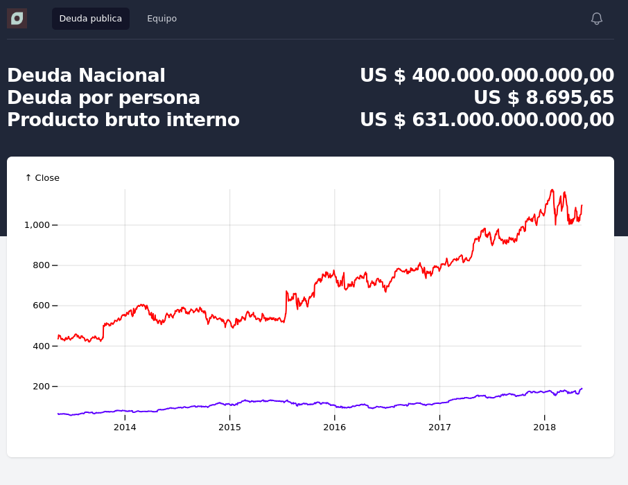

# Odia Deuda UI

Interfaz web del proyecto ODIA Deuda.

## Fuente de datos

Esta interfaz sera provista de una base de datos con informacion de [argentina.gob.ar](https://www.argentina.gob.ar/economia/finanzas/datos).
Mas informacion en la carpeta `database`.

## Comandos CLI

- `./dev.mjs` ambiente de desarrollo. Se puede acceder al proyecto en el puerto 8080 y cualquier cambio se vera reflejado automaticamente despues de guardar un archivo.
- `./build.mjs` genera los archivos para ambiente productivo.
- `./test.mjs` construye una version y ejecuta pruebas automatizadas

